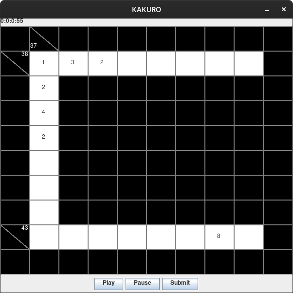

# Kakuro

> COMP 354: Introduction to Software Engineering

Source Code: https://github.com/binarytrails/kakuro

## Rules

1. Enter numbers from 1-9 in the input cells
2. Solve the puzzle with numbers adding up into sums found in slash fields

Filled cells notation means:

    (sum of rows below) \ (sum of columns to the right)

## UI

## Console

    welcome to kakuro game!
    => use numbers between 1-9 to fill the cells;
    board:
      x   37\   x    x    x    x    x    x    x    x  
     \43   _    _    _    _    _    _    _    _    x  
      x    _    x    x    x    x    x    x    x    x  
      x    _    x    x    x    x    x    x    x    x  
      x    _    x    x    x    x    x    x    x    x  
      x    _    x    x    x    x    x    x    x    x  
      x    _    x    x    x    x    x    x    x    x  
      x    _    x    x    x    x    x    x    x    x  
     \43   _    _    _    _    _    _    _    _    x  
      x    x    x    x    x    x    x    x    x    x  

    List of actions i=input s=solve a=answers
    Choose an action: i
    row: 9
    column: 2
    number: 9
    board:
      x   37\   x    x    x    x    x    x    x    x  
     \43   _    _    _    _    _    _    _    _    x  
      x    _    x    x    x    x    x    x    x    x  
      x    _    x    x    x    x    x    x    x    x  
      x    _    x    x    x    x    x    x    x    x  
      x    _    x    x    x    x    x    x    x    x  
      x    _    x    x    x    x    x    x    x    x  
      x    _    x    x    x    x    x    x    x    x  
     \43   9    _    _    _    _    _    _    _    x  
      x    x    x    x    x    x    x    x    x    x  

    List of actions i=input s=solve a=answers
    Choose an action: a
    board:
      x   37\   x    x    x    x    x    x    x    x  
     \43   1    3    4    5    6    7    8    9    x  
      x    2    x    x    x    x    x    x    x    x  
      x    3    x    x    x    x    x    x    x    x  
      x    4    x    x    x    x    x    x    x    x  
      x    5    x    x    x    x    x    x    x    x  
      x    6    x    x    x    x    x    x    x    x  
      x    7    x    x    x    x    x    x    x    x  
     \43   9    8    7    6    5    4    3    1    x  
      x    x    x    x    x    x    x    x    x    x  

    List of actions i=input s=solve a=answers
    Choose an action: 

# Team
- Vsevolod Ivanov seva@binarytrails.net
- Tiffany Ah King
- Isabelle Charette
- Brian Gamboc-Javiniar
- Chang Liu
- Nolan Mckay
- Nalveer Moocheet
- Hoang Thuan Pham
- Audrey-Laure St-Louis
- Jia Ming Wei
